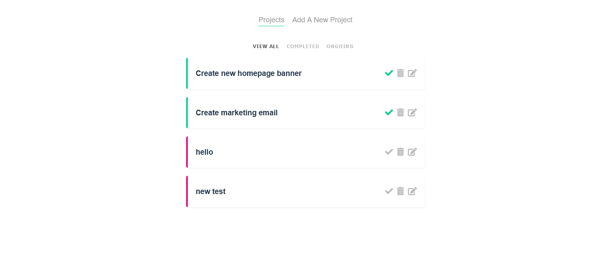

# project-planner

Project planner app that combines VueJS fundamentals to create an intuitive project planner app with full on edit, delete and completion state toggle.

## Screenshot


## Project setup

```
npm install
```

### Compiles and hot-reloads for development

```
npm run serve
```

### Compiles and minifies for production

```
npm run build
```

### Customize configuration

See [Configuration Reference](https://cli.vuejs.org/config/).
